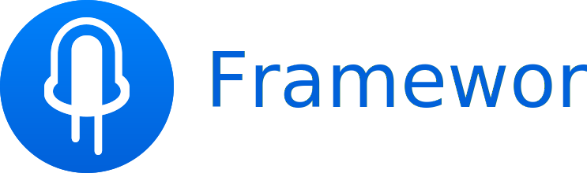

<h1 align="center">
  <br>
</h1>
<h3 align="center">
  A component library for Framer.
</h3>
 <p align="center">
  @steveruizok
  </p>
<br>
<p align="center">
   <br>
  Accellerate your designs<br>with pre-built components. <br><br></span>
   <br>
  Create custom themes<br>to match your product. <br><br>
   <br>
  Build even further<br>with your own components. <br><br>
</ul>
</p>

# Introduction
Framework is a component library module for [Framer](https://framer.com/), designed to reduce complexity and increase speed for prototyping. The library provides ready solutions to many individual elements, such as buttons, toggles or text inputs, while also introducing larger components, such as FormComponent, for handling more complex behavior. Framework also contains a robust system for managing content across very large prototypes.

# Installation
Clone or download this repository. The repo contains three Framer projects: 
* `docs.framer`, interactive documentation for each Framework component
* `example.framer`, an example project with annotations 
* `quickstart.framer.`, a blank canvas for starting new projects

To begin a new project, create a copy of the `quickstart.framer` project.

# Usage

Framework is a complex project, and its documentation (like the project itself) remains a work in progress.

* [Interactive documentation](https://framer.cloud/coOSs) for Framework (built in Framework itself)
* [Written documentation](https://github.com/steveruizok/framework/wiki) on this project's wiki

## The basics

Every Framework project will involve a single `App` instance and one or more `View` instances.

```coffeescript
require "framework"

app = new App


# First View

firstView = new View
    title: "First View"
    key: "0.0.0"

firstView.onLoad ->
    new H3
        parent: @content
        y: 24
        x: Align.center()
        text: "First View"
        
    btn = new Button
        parent: @content
        x: Align.center()
        text: "Get Started"
        
    tn.onSelect -> app.showNext(secondView)
        
firstView.onPostload ->
    Utils.stack(@content.children, 16)


# Second View

secondView = new View
    title: "Second View"
    key: "1.0.0"

secondView.onLoad ->
    new H3
        parent: @content
        y: 24
        x: Align.center()
        text: "Second Page"
        
secondView.onPostload ->
    Utils.stack(@content.children, 16)
```

# Author's Note

I've been lucky enough to spend the last year designing and prototyping in Framer. Along the way, I built and maintained several component libraries, each acting as a recycling system for the solutions to the problems I'd face in each new project and challenge. Framework is the most mature of these systems.
